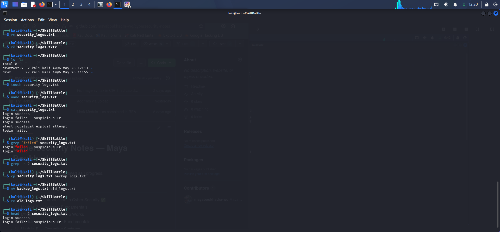

# 🐧 Linux Command Line Basics

This file contains the foundational Linux commands essential for system administration and security operations.

## 📂 1. Navigation & Directory Exploration
* `pwd` - Prints the current working directory path.
* `ls` - Lists files and directories in the current location.
* `ls -la` - Lists all files, including hidden ones, with details like permissions and size.
* `cd <directory>` - Changes the current directory.

---

## 🛠️ 2. File & Directory Management
* `mkdir <name>` - Creates a new directory.
* `touch <filename>` - Creates an empty file.
* `nano <filename>` - Opens a terminal-based text editor to modify files.
* `cp <source> <destination>` - Copies files or directories.
* `mv <source> <destination>` - Moves or renames files or directories.
* `rm <filename>` - Removes/deletes a file.

---

## 🔍 3. File Viewing & Log Filtering (SOC Essentials)
* `cat <filename>` - Displays the entire content of a file.
* `head -n <number>` - Views the first N lines of a file.
* `tail -n <number>` - Views the last N lines of a file (useful for monitoring live logs).
* `grep "<pattern>" <filename>` - Searches for specific text or patterns within a file.

---

## 👑 4. Privilege Management
* `sudo <command>` - Executes commands with administrative (root) privileges.

* ## 📸 My Kali Linux Lab Practice

Here is a screenshot of my practical application of these commands inside the Kali Linux Terminal:

