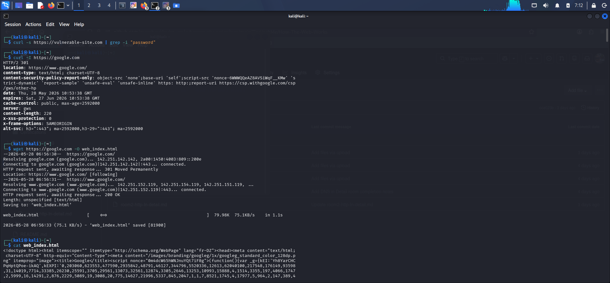

# 🌐 How Websites Work: Reconnaissance & Web Security

This lab combines the foundational web concepts learned in TryHackMe with practical command-line reconnaissance inside Kali Linux.

---

## 🧩 1. Web Structure & Sensitive Data Exposure
**What I Learned (TryHackMe):** Websites are built using HTML (structure), CSS (styling), and JavaScript (interactivity). A common vulnerability is **Sensitive Data Exposure**, where developers accidentally leave hidden comments, private links, or credentials in the frontend source code, accessible to anyone via "View Page Source".

**How I Applied It (Kali Linux):**
Instead of using a GUI browser, I used the terminal to instantly fetch a site's source code and scan it for exposed credentials using pipeline filtering.

```bash
curl -s [https://vulnerable-site.com](https://vulnerable-site.com) | grep -i "password"

Security Takeaway: If a developer left a comment like ``, grep would instantly highlight it. In this automated scan, the prompt returned clean, indicating no obvious plaintext passwords in the frontend text.

🛡️ 2. Client-Side Security & HTTP Headers
What I Learned (TryHackMe): Web servers process client-side requests and return data. Security starts at the header level. For a SOC Analyst, inspecting these headers reveals if a site is using protection mechanisms like Web Application Firewalls (WAF) or security policies to prevent attacks like HTML Injection.

How I Applied It (Kali Linux):
I intercepted and analyzed the raw HTTP response headers from a live server using the command line.

curl -I [https://google.com](https://google.com)

📸 My Terminal Output & Analysis:
Analysis of My Output: > * server: gws: Identifies the backend web server software.

x-frame-options: SAMEORIGIN: A defensive header that prevents Clickjacking attacks by restricting the page from being framed on external sites.

content-security-policy-report-only: Helps mitigate Cross-Site Scripting (XSS) and code injection by controlling which resources are allowed to load.

📄 3. Document Object Model (DOM) & Local Storage
What I Learned (TryHackMe): JavaScript interacts with the page via the DOM (Document Object Model). If a site fails to perform Input Sanitization (filtering malicious text entered by users), attackers can inject malicious HTML/JS tags, altering the site's functionality.

How I Applied It (Kali Linux):
To safely audit a website's full client-side code structure without executing malicious scripts in a browser, I downloaded the complete document locally.
wget [https://google.com](https://google.com) -O web_index.html
cat web_index.html

Defensive Takeaway: Downloading the raw code (saved [81900 bytes]) allows a security analyst to safely audit the script sources (like looking for <script src="..."> tags) and inspect how user input fields are handled before rendering.

```

