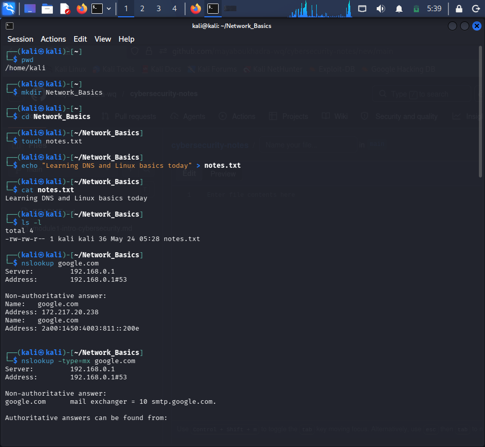

# Module 3 — How The Web Works

## Room 1: DNS in Detail
**Date: May 24, 2026**

Today, I successfully completed the "DNS in Detail" room on TryHackMe. I learned how the Domain Name System functions as the internet's phonebook, translating human-readable names into machine-readable IP addresses.

### 🧠 Key Takeaways:
* **Domain Structure:** Understood TLDs (like `.com`), Second-Level Domains, and Subdomains.
* **DNS Record Types:** Learnt the difference between `A` (IPv4), `AAAA` (IPv6), `MX` (Mail Exchange), and `TXT` (Text) records.
* **DNS Query Journey:** Analyzed how resolvers fetch information and the role of TTL (Time To Live).

---

### 💻 Practical Application in Kali Linux:
I executed a structured workflow combining Linux file system commands and network diagnostic tools to verify DNS records in real-time.

#### Advanced Network Commands Executed:
1. `nslookup google.com` - Resolved the domain to its IPv4 address.
2. `nslookup -type=mx google.com` - Found the Mail Exchanger server with a priority value of `10`.
3. `nslookup -type=txt favebook.com` - Retrieved the TXT record for security verification (`v=spf1 -all`).
4. `dig google.com` - Extracted deep DNS data, including a TTL value of `281` seconds.

### 📸 Execution Screenshot:

